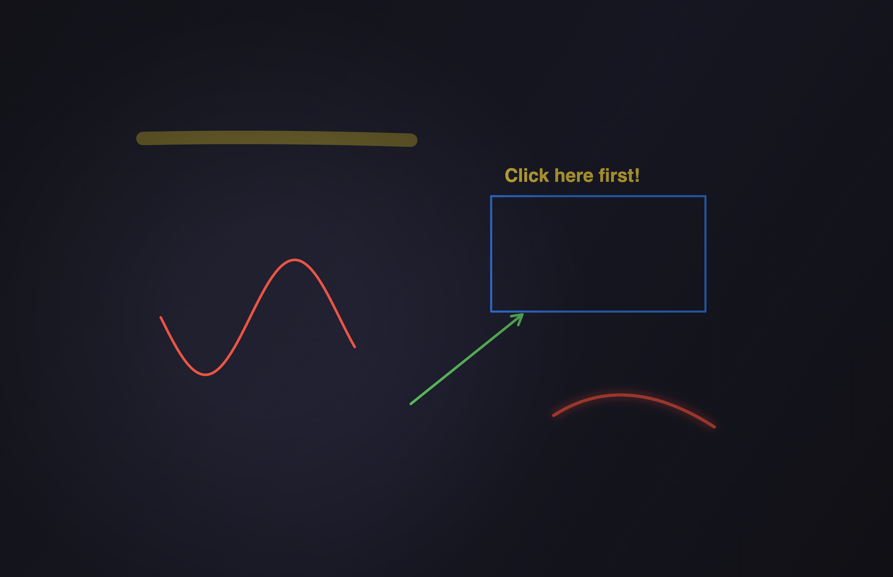
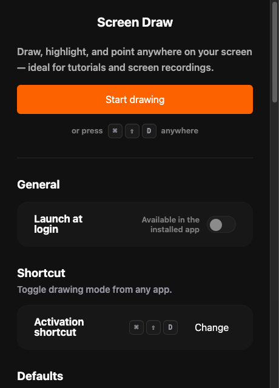

# Screen Draw

🇵🇱 [Wersja polska](README.pl.md)

**Draw on your screen.** A fast, keyboard-driven macOS annotation tool for tutorials, live demos, and presentations — pen, shapes, text, a fading laser pointer, cursor highlight, and spotlight, all floating above whatever you're showing.



## Why

Made for presenters and tutorial creators who want to point at things *right now*: one global shortcut and you're drawing over any app, full-screen video calls included. Everything is a single keypress away, the overlay costs ~0% CPU when idle, and annotations never end up where you can't undo them.

## Features

### Drawing tools


| Tool | Key | Notes |
|---|---|---|
| Select & move | `V` | Grab, drag, restyle, or delete any committed annotation |
| Pen | `P` | Smoothed freehand ink; hold `⇧` for a straight line |
| Highlighter | `H` | Wide translucent band |
| Laser pointer | `F` | Glowing stroke that holds briefly, then fades — never enters undo/clear |
| Eraser | `E` | Drag across strokes to remove them; one drag = one undo step |
| Text | `X` | Click, type, `Enter` — then select/move/restyle it like any shape |
| Line / Arrow | `L` / `A` | Hold `⇧` to snap to 45° |
| Rectangle / Ellipse | `R` / `O` | Hold `⇧` for square / circle |

Plus: colors `1`–`6` + custom picker with recents, brush size `[` `]`, undo/redo `⌘Z` / `⌘⇧Z`, clear `C`, board mode `W` (transparent → whiteboard → blackboard), session ink `G` (auto-clean slate on exit), pin annotations `S` (keep them on screen, click-through), export annotated screenshot `D` (PNG to `~/Downloads` + clipboard), hide toolbar `T`, hide toolbar from recordings `⇧R`. Full guide: [docs/features.md](docs/features.md).

### Presenter effects

Work even when you're **not** drawing — toggle from the toolbar, control panel, or menu-bar tray:

- **Cursor highlight** — a configurable ring around your pointer, impossible to lose.
- **Spotlight** — dims everything outside a feathered circle around the cursor.

### Multi-display

One overlay per display; hover to switch. The toolbar follows you, with a choice of one shared position + tool settings across displays, or independent per-display setups.

### Control panel



Global activation shortcut (default `⌘⇧D`), defaults, toolbar behavior, presenter effects, launch at login.

## Install

Grab `Screen Draw-<version>-arm64.dmg` (Apple Silicon), drag the app to `/Applications`, then — because the build is unsigned — on first run:

1. **Right-click the app → Open → Open** (or, on newer macOS: System Settings → **Privacy & Security** → "Open Anyway").
2. Grant **Screen Recording** and **Accessibility** when prompted (needed to draw over other apps and to export screenshots).

> **Where do I get the .dmg?** Prebuilt, ready-to-run builds are a thank-you gift for community members and supporters. You can always build it yourself from source (below) — same app, zero restrictions.

## Build from source

Requirements: macOS (Apple Silicon), Node ≥ 22, npm.

```bash
git clone https://github.com/Szewowsky/screen-draw.git
cd screen-draw
npm ci
npm run dev        # build + launch
npm run dist       # build the .dmg into dist/
```

Checks: `npm run lint`, `npm run type-check`, `npm test` (Vitest over the pure drawing model — 150+ tests). Release history: [CHANGELOG.md](CHANGELOG.md).

## Built in the open, with AI agents

This app is developed through an AI-agent workflow: PRDs and slice issues are authored by Claude, implementation runs autonomously (Codex / Claude agents), every release passes lint + type-check + tests, and the whole process is preserved in the repo — see [`docs/prd/`](docs/prd/), the `docs/*-backlog.md` drain files, and the [issue history](https://github.com/Szewowsky/screen-draw/issues?q=is%3Aissue). Even the performance investigations (latency instrumentation, measured-and-rejected refactors) are documented. If you're curious how far spec-first agent development can go — this repo is a live specimen.

## Tech

Electron 43 · TypeScript · React 19 (with React Compiler) · Tailwind 4 · Vite 8 · Vitest. Transparent always-on-top overlay windows (one per display), a pure immutable drawing model with undo/redo, offscreen-cached rendering with ≤1 repaint per frame, and zero idle work.

## License

[MIT](LICENSE) — the code is free. If Screen Draw saves your demo one day, consider supporting the project. 🧡
